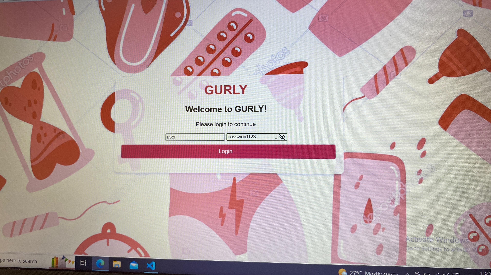
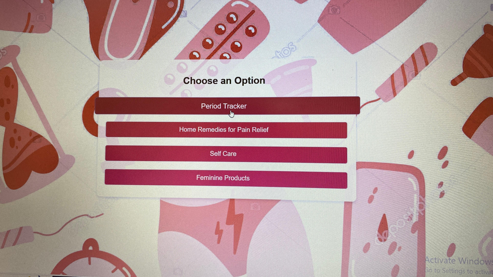
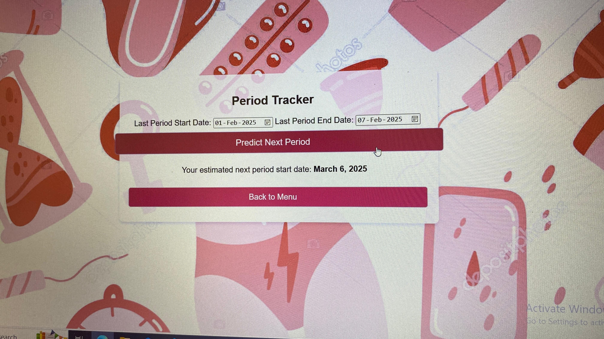

# [Project Name] 🎯

## Basic Details
### Team Name: code crafters

### Team Members
- Member 1: fathima fasna - pptm cherur
- Member 2: sneha mohan -pptm cherur
- Member 3: noora jasmin - pptm cherur

### Hosted Project Link
[mention your project hosted project link here]

### Project Description
GURLY is a web-based app designed to support menstrual health by providing features like a period tracker, self-care tips, and home remedies for pain relief. It also offers information on feminine products to help users manage their menstrual cycle.

### The Problem statement
menstruation is painfull process,the person enduring somuch pain during the process,we could not remember last period date

### The Solution
GURLY solves this by giving users a smooth, interactive experience to track their periods, find relief for menstrual cramps, explore self-care options, and learn about feminine hygiene products. All your menstrual health needs in one fun and easy-to-use 

## Technical Details
### Technologies/Components Used
For Software:
- Languages used:HTML
- Frameworks used:css
- Libraries used:java script
- Tools used:text editor(eg:vs code,notepad,google chrome)

# Run
0pen index.html in any latest browser

### Project Documentation
For Software:
HTML,CSS,JAVA SCRIPT

# Screenshots (Add at least 3)

This is a login screen for "GURLY." The theme is pink and red. It features menstrual-related icons. The username and password fields are filled. A Windows activation watermark is visible. The platform may relate to women's health.

The image shows a menu screen from a “Period Tracker” app. The heading says “Choose an Option.” There are four buttons:
	1.	Period Tracker
	2.	Home Remedies for Pain Relief
	3.	Self Care
	4.	Feminine Products

The background has pink and red illustrations of menstrual products. A Windows activation message is visible in the bottom right corner. A cursor is pointing at the “Period Tracker” option.

The image shows a “Period Tracker” app. It has input fields for the last period’s start and end dates. The dates entered are from February 1 to February 7, 2025. There is a button labeled “Predict Next Period.” Another button says “Back to Menu.” The background has pink and red menstrual product illustrations. A Windows activation message appears in the bottom right corner.

### Project Demo
# Video
[demovideo](images/demovideo.mp4)
*it demonstrate the period tracker working and self care tips,home remedies,some femine products*

# Additional Demos
[Add any extra demo materials/links]

## Team Contributions
- [ fathima fasna]: [code creater]
- [sneha mohan]: [problem solver]
- [noora jasmin]: [idea maker]

---
Made with ❤️ at TinkerHub
